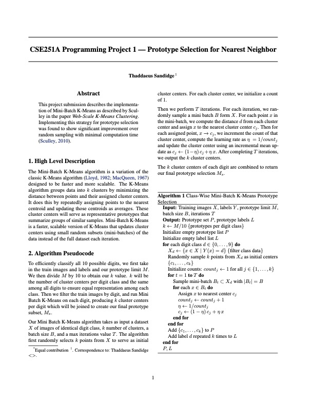
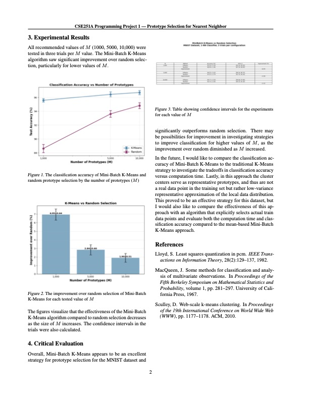

# Nearest Neighbors Prototype Selection

Implementing the Mini-Batch K-Means algorithm (Sculley, 2010) to improve prototype selection for hand drawn digit classification for a 1-NN model on the MNIST dataset. Results showed significant improvements over random selection.

## 📄 Writeup

Full project writeup:  
➡️ [View PDF](CSE251A_Project_1___Thad_Sandidge.pdf)
